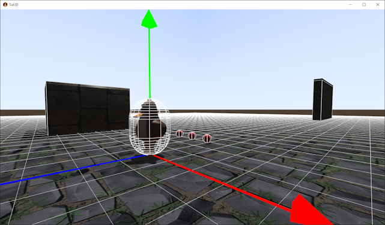

# 3D Tutorial - Step 5 - Physics and collisions
by Monstrous Software


# Step 5 - Physics and collisions

As we saw in the previous step we don't have collision detection yet, nor do we have any physics (rigid body simulation).  
We will add both by making use of a physics library.  There are multiple physics libraries available.  A popular choice is Bullet, but this is not supported for HTML/GWT versions, because it makes use of a native library written in C.
However, we will make use of the ODE4j library, which is a conversion of the ODE physics library to Java. and also available to use in a web version of your game. 
The manual for ODE can be found at [ode.org](https://ode.org/wiki/index.php/Manual).

In particular, we will make use of the library [gdx-ode4j](https://github.com/antzGames/gdx-ode4j) by AntzGames. 
It is not a standard extension, we will need to follow the instructions on the gdx-ode4j page to integrate it into our project:

Open the file `build.gradle` in the `core` module of our project. This file defines what dependencies the core module of our project has on external libraries. 
Add a line to include the latest version of gdx-ode4j:

```java
        [compileJava, compileTestJava]*.options*.encoding = 'UTF-8'
        eclipse.project.name = appName + '-core'
        
        dependencies {
            api "com.badlogicgames.gdx-controllers:gdx-controllers-core:$gdxControllersVersion"
            api "com.badlogicgames.gdx:gdx:$gdxVersion"
            api "com.github.antzGames:gdx-ode4j:master-SNAPSHOT"                    // <------ add this line
            api "com.github.mgsx-dev.gdx-gltf:gltf:$gdxGltfVersion"                 
            api "de.golfgl.gdxcontrollerutils:gdx-controllerutils-mapping:$controllerMappingVersion"
            api "de.golfgl.gdxcontrollerutils:gdx-controllerutils-scene2d:$controllerScene2DVersion"
        }
```
As we have updated a gradle file, we now need to refresh the Gradle project. Click on the Gradle refresh icon in the IDE:


We will wrap most of the ODE4j specifics inside a new class called PhysicsWorld:
```java
        public class PhysicsWorld implements Disposable {

            DWorld world;
            public DSpace space;
            private final DJointGroup contactgroup;
        
            public PhysicsWorld() {
                OdeHelper.initODE2(0);
                Gdx.app.log("ODE version", OdeHelper.getVersion());
                Gdx.app.log("ODE config", OdeHelper.getConfiguration());
                contactgroup = OdeHelper.createJointGroup();
                reset();
            }
        
            // reset world, note this invalidates (orphans) all rigid bodies and geoms so should be used in combination with deleting all game objects
            public void reset() {
                if(world != null)
                    world.destroy();
                if(space != null)
                    space.destroy();
        
                world = OdeHelper.createWorld();
                space = OdeHelper.createSapSpace( null, DSapSpace.AXES.XYZ );           
        
                world.setGravity (0, 0, Settings.gravity); 
                world.setCFM (1e-5);
                world.setERP (0.4);
                world.setQuickStepNumIterations (40);
                world.setAngularDamping(0.5f);
        
                // set auto disable parameters to make inactive objects go to sleep
                world.setAutoDisableFlag(true);
                world.setAutoDisableLinearThreshold(0.1);
                world.setAutoDisableAngularThreshold(0.001);
                world.setAutoDisableTime(2);
            }
        
            // update the physics with one (fixed) time step
            public void update() {
                space.collide(null, nearCallback);
                world.quickStep(0.05f);
                contactgroup.empty();
            }
        
            private DGeom.DNearCallback nearCallback = new DGeom.DNearCallback() {
        
                @Override
                public void call(Object data, DGeom o1, DGeom o2) {
                    DBody b1 = o1.getBody();
                    DBody b2 = o2.getBody();
                    if (b1 != null && b2 != null && OdeHelper.areConnected(b1, b2))
                        return;
        
                    final int N = 8;
                    DContactBuffer contacts = new DContactBuffer(N);
        
                    int n = OdeHelper.collide(o1, o2, N, contacts.getGeomBuffer());
                    if (n > 0) {
        
                        for (int i = 0; i < n; i++) {
                            DContact contact = contacts.get(i);
                            contact.surface.mode = dContactSlip1 | dContactSlip2 | dContactSoftERP | dContactSoftCFM | dContactApprox1;
                            if (o1 instanceof DSphere || o2 instanceof DSphere || o1 instanceof DCapsule || o2 instanceof DCapsule)
                                contact.surface.mu = 0.01;  // low friction for balls & capsules
                            else
                                contact.surface.mu = 0.5;
        
                            contact.surface.slip1 = 0.0;
                            contact.surface.slip2 = 0.0;
                            contact.surface.soft_erp = 0.8;
                            contact.surface.soft_cfm = 0.01;
        
                            DJoint c = OdeHelper.createContactJoint(world, contactgroup, contact);
                            c.attach(o1.getBody(), o2.getBody());
                        }
                    }
                }
            };
        
            @Override
            public void dispose() {
                contactgroup.destroy();
                space.destroy();
                world.destroy();
                OdeHelper.closeODE();
            }
        
        }
```
## ODE Physics intro

ODE supports rigid bodies (bodies) and geometry nodes (geoms). A rigid body is a point mass that has mass, has a position and may have a linear velocity and an angular (rotational) velocity. 
Bodies can be accelerated by applying a force on them and can be rotated by applying torque on them.  By default, all bodies have gravity applied to them. Geoms are shapes that are used by ODE for collision detection.   
There are some basic shapes available: boxes, spheres, capsules, cylinders, etcetera. 
Or you can define a geom shape via a mesh to make any shape you want.  For efficiency, it is best to use the simplest shapes you can.
Rigid bodies live in a container of type DWorld amd geoms live in a container called DSpace.
Often we will link a rigid body and a geom.  Static game objects, like the floor for example, may have only a geom for collisions, but no rigid body as it will never move.  
Rigid bodies can be connected by joints.  There are different types of joints available. For example, if you want to model a car you may want to connect the wheels with joints to the chassis. You may also want to use
joints to simulate the car suspension.

ODE also uses temporary joints to simulate collision response. Such joints will only exist for one step of the simulation.  They are created for every collision that is detected to join the two colliding bodies with a contact joint. 
Then in the physics simulation step these joints will push the bodies apart depending on the bounciness, the friction parameters, etcetera.

The main simulation loop is the following:
```java
            public void update() {
                space.collide(null, nearCallback);
                world.quickStep(0.05f);
                contactgroup.empty();
            }
```
The first line will test for collisions of all the geoms in the space. For any pair of potential colliding geoms, the callback function is called. The callback function will check if the shapes are indeed colliding and if so create a contact joint for each contact between the two geoms.
The second line will advance all the rigid bodies for one time step, applying all the velocities, forces and torques to calculate their new position, orientation and velocities.  
ODE works best with a fixed time step, so we don't use deltaTime here. We will need to copy the new positions and orientations to the game objects before rendering. 
The third line deletes all the contact joints that we created in the collision step, ready for the next loop.

For the gravity value we refer to a new variable in the Settings class:
```java
        static public float gravity = -9.8f;   // meters/s^2
```
Note that for the ODE classes we use the convention that the Z axis is the up axis. That is why we set the gravity vector as (0,0,-9.8f). 

## Update World class

The PhysicsWorld class will be instantiated in the World class. Add the following variable to the World class:
```java
        public final PhysicsWorld physicsWorld;
```
Initialize it in the constructor before the call of populate():
```java   
        physicsWorld = new PhysicsWorld();
```
Create an update method in World that calls the update method of Dynamics:
```java
        public void update( float deltaTime ) {
            physicsWorld.update();
        }
```
And dispose the dynamics instance in World.dispose():
```java
        physicsWorld.dispose();
```

At this moment, the code compiles but nothing is different when we run the application. This is because we have not yet linked the game objects to physics objects.

## PhysicsBody

Let us create a class that represents a physics body. Its main purpose is to encapsulate a DGeom object.  Note that a geom can in turn be linked to a rigid body using `geom.setBody()`.

Then for convenience we add methods to get the position and orientation of the geom, converting from ODE's internal format to the LibGDX standard format for Vector3 and Quaternion.
These methods will also convert from the reference frame we use within the ODE classes (Z is up) to the LibGDX reference frame (Y is up) and vice versa.

> Side note: You could wonder why we convert between ODE and LibGDX reference frames. Why don't we use the same x, y and z in both parts of the program?  And in fact, this works reasonably well. 
> If we set gravity to work on the Y axis, then objects will fall along the Y axis. ODE is agnostic with regard to which particular coordinate system you want to use.
> However, when we define geom shapes for cylinders and capsules, ODE appears to make a hard assumption that the main axis is on Z. 
> Because cylinders, and especially capsules, are important shapes for efficient collision detection, it is worth converting between the two reference frames, both right-handed coordinate systems.
> From ODE to LibGDX the conversion is: X := x, Y :=-z, Z := y. From LibGDX to ODE it is: x := X, y := Z, z := -Z.
> We will come back to this and provide a more elegant solution in step 15.

Lastly, we add a ModelInstance object that we will use in debug mode to visualize the geom.  It can be very hard to find errors in the physics handling if we can't see the collision shapes.
So we introduce this debug option early.
```java
        public class PhysicsBody {
        
            public DGeom geom;
            private Vector3 position;               // for convenience, matches geom.getPosition() but converted to Vector3
            private Quaternion quaternion;          // for convenience, matches geom.getQuaternion() but converted to LibGDX Quaternion
            private ModelInstance debugInstance;    // visualisation of collision shape for debug view
        
            public PhysicsBody(DGeom geom, ModelInstance debugInstance) {
                this.geom = geom;
                this.debugInstance = debugInstance;
                position = new Vector3();
                quaternion = new Quaternion();
            }
        
            public Vector3 getPosition() {
                DVector3C pos = geom.getPosition();
                position.x = (float) pos.get0();
                position.y = (float) pos.get2();        // note: swap Y and Z
                position.z = -(float) pos.get1();
                return position;
            }
        
            public void setPosition( Vector3 pos ) {
                geom.setPosition(pos.x, -pos.z, pos.y);  // swap Y and Z
                DBody rigidBody = geom.getBody();
                if(rigidBody != null)
                    rigidBody.setPosition(pos.x, -pos.z, pos.y);  // swap Y and Z
            }
        
            public Quaternion getOrientation() {
                DQuaternionC odeQ = geom.getQuaternion();
                float ow = (float) odeQ.get0();
                float ox = (float) odeQ.get1();
                float oy = (float) odeQ.get2();
                float oz = (float) odeQ.get3();
                quaternion.set(ox, oz, -oy, ow);
                return quaternion;
            }
        
            public void setOrientation( Quaternion q ){
                DQuaternion odeQ = new DQuaternion(q.w, -q.x, -q.z, q.y);       // convert to ODE quaternion
                geom.setQuaternion(odeQ);
                DBody rigidBody = geom.getBody();
                if(rigidBody != null)
                    rigidBody.setQuaternion(odeQ);
            }
        
            public void render(ModelBatch batch) {
                // move & orient debug modelInstance in line with geom
                debugInstance.transform.set(getPosition(), getOrientation());
                batch.render(debugInstance);
            }
        }
```

To present the debug view of all collision shapes corresponding to World game objects, we add a simple class with a ModelBatch that shows all debug instances:

```java
        public class PhysicsView implements Disposable {
        
            private final ModelBatch modelBatch;
            private final World world;      // reference
        
            public PhysicsView(World world) {
                this.world = world;
                modelBatch = new ModelBatch();
            }
        
            public void render( Camera cam ) {
                modelBatch.begin(cam);
                int num = world.getNumGameObjects();
                for(int i = 0; i < num; i++) 
                    world.getGameObject(i).body.render(modelBatch);
                modelBatch.end();
            }
        
            @Override
            public void dispose() {
                modelBatch.dispose();
            }
        }
```

## Extension of GameObject class

Now the GameObject class needs to be extended so that each game object not only has a Scene field for the rendering but also a PhysicsBody field for the dynamic movement.
```java
        public class GameObject {
        
            public final Scene scene;
            public final PhysicsBody body;
        
            public GameObject(Scene scene, PhysicsBody body) {
                this.scene = scene;
                this.body = body;
                body.geom.setData(this);            // the geom has user data to link back to GameObject for collision handling
            }
        }
```
Whenever we construct a GameObject, we set the data field of the related geom to the game object itself. This will be handy when we detect collisions between geoms to find the corresponding game objects.
We can use this to pick up a weapon for example.


We'll also need to define a mass for the rigid body and a collision shape for the geom.
The mass determines how much a body accelerates when a force is applied.

The shape of the graphics object, the mesh, is typically approximated with a simplified shape for the sake of efficient collision detection.
This we call the collision proxy or the collision shape. For example, the player may have a capsule as a collision shape.  A wall may have a box shape to approximate it, a skull is perhaps approximated by a sphere.
We can also use the mesh itself as collision shape. This is the most accurate, but is inefficient if the mesh is complex.

For the shape type, we'll introduce an enumeration:
```java
        public enum CollisionShapeType {
            BOX, SPHERE, CAPSULE, CYLINDER, MESH
        }
```


-- collision proxies in debug view

The follow class is a factory class for PhysicsBody objects.
We use the bounding box of the node to obtain the object's dimensions. Depending on the desired shape type, it will create a geom of the right type and dimensions (we will add support for the MESH type later).
For debugging it will also create a ModelInstance of the right type.  Unless the game object is a static object, it will create a rigid body and attach it to the geom.

```java
        public class PhysicsBodyFactory implements Disposable {
        
            public static final long CATEGORY_STATIC  = 1;      // collision flags
            public static final long CATEGORY_DYNAMIC  = 2;     // collision flags
        
            private PhysicsWorld physicsWorld;
            private DMass massInfo;
            private final Vector3 position;
            private Quaternion q;
            private ModelBuilder modelBuilder;
            private Material material;
            private Array<Disposable> disposables;
        
            public PhysicsBodyFactory(PhysicsWorld physicsWorld) {
                this.physicsWorld = physicsWorld;
                massInfo = OdeHelper.createMass();
                q = new Quaternion();
                modelBuilder = new ModelBuilder();
                material = new Material(ColorAttribute.createDiffuse(Color.WHITE));
                disposables = new Array<>();
            }
        
            public PhysicsBody createBody( ModelInstance collisionInstance, CollisionShapeType shapeType, float mass, boolean isStatic) {
                BoundingBox bbox = new BoundingBox();
                Node node = collisionInstance.nodes.first();
                node.calculateBoundingBox(bbox, false); // bounding box without the transform
                float w = bbox.getWidth();
                float h = bbox.getHeight();
                float d = bbox.getDepth();
        
                DGeom geom;
                ModelInstance instance;
                float diameter = 0;
                float radius = 0;
                float len;
        
                switch(shapeType) {
                    case BOX:
                        geom = OdeHelper.createBox(physicsWorld.space, w, d, h);    // swap d & h
                        break;
                    case SPHERE:
                        diameter = Math.max(Math.max(w, d), h);
                        radius = diameter/2f;
                        geom = OdeHelper.createSphere(physicsWorld.space, radius);
                        break;
                    case CAPSULE:
                        diameter = Math.max(w, d);
                        radius = diameter/2f; // radius of the cap
                        len = h - 2*radius;     // height of the cylinder between the two end caps
                        geom = OdeHelper.createCapsule(physicsWorld.space, radius, len);
                        break;
                    case CYLINDER:
                        diameter = Math.max(w, d);
                        radius = diameter/2f; // radius of the cap
                        len = h;     // height of the cylinder between the two end caps
                        geom = OdeHelper.createCylinder(physicsWorld.space, radius, len);
                        break;
                    default:
                        throw new RuntimeException("Unknown shape type");
                }
        
                if(isStatic) {
                    geom.setCategoryBits(CATEGORY_STATIC);   // which category is this object?
                    geom.setCollideBits(0);                  // which categories will it collide with?
                    // note: geom for static object has no rigid body attached
                }
                else {
                    DBody rigidBody = OdeHelper.createBody(physicsWorld.world);
                    massInfo.setBox(1, w, d, h);    // swap d & h
                    massInfo.setMass(mass);
                    rigidBody.setMass(massInfo);
                    rigidBody.enable();
                    rigidBody.setAutoDisableDefaults();
                    rigidBody.setGravityMode(true);
                    rigidBody.setDamping(0.01, 0.1);
        
                    geom.setBody(rigidBody);
                    geom.setCategoryBits(CATEGORY_DYNAMIC);
                    geom.setCollideBits(CATEGORY_DYNAMIC|CATEGORY_STATIC);
                }
        
        
                // create a debug model matching the collision geom shape
                modelBuilder.begin();
                MeshPartBuilder meshBuilder;
                meshBuilder = modelBuilder.part("part", GL20.GL_LINES, VertexAttributes.Usage.Position , material);
                switch(shapeType) {
                    case BOX:
                        BoxShapeBuilder.build(meshBuilder, w, h, d);
                        break;
                    case SPHERE:
                        SphereShapeBuilder.build(meshBuilder, diameter, diameter, diameter , 8, 8);
                        break;
                    case CAPSULE:
                        CapsuleShapeBuilder.build(meshBuilder, radius, h, 12);
                        break;
                    case CYLINDER:
                        CylinderShapeBuilder.build(meshBuilder, diameter, h, diameter, 12);
                        break;
                }
                Model modelShape = modelBuilder.end();
                disposables.add(modelShape);
                instance = new ModelInstance(modelShape, Vector3.Zero);
        
                PhysicsBody body = new PhysicsBody(geom, instance);
        
                // copy position and orientation from modelInstance to body
                collisionInstance.transform.getTranslation(position);
                collisionInstance.transform.getRotation(q);
                body.setPosition(position);
                body.setOrientation(q);
                return body;
            }

        
            @Override
            public void dispose() {
                for(Disposable d : disposables)
                    d.dispose();
            }
        }
```


## Modeling caveat

Note that there is an important constraint on how the objects are modeled in Blender in order for the collision shapes to be in the correct position:
Objects need to be modeled with their centre on the origin and be axis-aligned.  The point at the origin will be used as centre of mass for the rigid body physics.
However, the objects can then still be moved around in Blender as long as the transforms are not applied.
So in Blender you need to:
1. position the object centred on the origin. 
2. Then use 'apply all transforms' (Control-A).
3. Now you can move the object to where you want it to appear. For example, on top of the ground instead of halfway in the ground. You can also rotate it or scale it.
4. But do NOT apply transforms of this new position, orientation or scale.

This way the collision shape will be calculated relative to the original position which was centred on the origin.
The final transform is taken from node.globalTransform and is used to set the modelInstance transform.


<figcaption>step 1 - centre the object on the origin and apply transform.</figcaption>


<figcaption>step 3 - position the object to the desired loction, e.g. with the feet at ground level, but do not apply transform.</figcaption>


<figcaption>if the applied transform is not centred on the origin, the collision shape and the graphical mesh will be misaligned. Here the feet are placed at the centre of mass. </figcaption>


## SpawnObject

It is time to adapt the method World.spawnObject.  It now has extra parameters for mass and shape type.  
```java
        public GameObject spawnObject(boolean isStatic, String name, CollisionShapeType shape, Vector3 position, float mass){
            Scene scene = new Scene(sceneAsset.scene, name);
            if(scene.modelInstance.nodes.size == 0)
                throw new RuntimeException("Cannot find node in GLTF file: " + name);
    
            applyNodeTransform(scene.modelInstance, scene.modelInstance.nodes.first());         // incorporate nodes' transform into model instance transform
            scene.modelInstance.transform.translate(position);
    
            PhysicsBody body = factory.createBody(scene.modelInstance, shape, mass, isStatic);
            GameObject go = new GameObject(scene, body);
            gameObjects.add(go);
            isDirty = true;         // list of game objects has changed
            return go;
        }
    
        private void applyNodeTransform(ModelInstance modelInstance, Node node ){
            modelInstance.transform.mul(node.globalTransform);
            node.translation.set(0,0,0);
            node.scale.set(1,1,1);
            node.rotation.idt();
            modelInstance.calculateTransforms();
        }
```

The Populator class needs to be adapted to support the extra parameters required per object, such as isStatic, shape type and mass.
```java
        public class Populator {
        
            public static void populate(World world) {
                world.clear();
        
                world.spawnObject(true, "brickcube", CollisionShapeType.BOX, Vector3.Zero, 1);
                world.spawnObject(true, "groundbox", CollisionShapeType.BOX, Vector3.Zero, 1f);
                world.spawnObject(true, "brickcube.001", CollisionShapeType.BOX,Vector3.Zero, 1f);
                world.spawnObject(true, "brickcube.002", CollisionShapeType.BOX,Vector3.Zero, 1f);
                world.spawnObject(true, "brickcube.003", CollisionShapeType.BOX,Vector3.Zero, 1f);
                world.spawnObject(true, "wall", CollisionShapeType.BOX,Vector3.Zero, 1f);
                world.spawnObject(false, "ball", CollisionShapeType.SPHERE, new Vector3(0,4,0), 1f);
                world.spawnObject(false, "ball", CollisionShapeType.SPHERE,new Vector3(-1,5,0), 1f);
                world.spawnObject(false, "ball", CollisionShapeType.SPHERE, new Vector3(-2,6,0), 1f);
                world.player = world.spawnObject(false, "ducky",CollisionShapeType.SPHERE, Vector3.Zero, 1f);
            }
        }
```
For testing, it is useful to restart the game from the initial state.  To allow this by pressing 'R', add the following line to `GameScreen.render()`:

```java
        if (Gdx.input.isKeyJustPressed(Input.Keys.R))
            Populator.populate(world);
```
This concludes step 5 of this tutorial. We've now added collision handling and physics to our template.  
You should be able to see the three balls in the game, dropping to the ground and making a small bounce. Press R in the game to reload and see it again.



